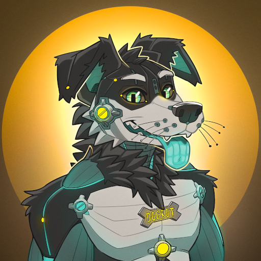

# <p align="center">DogBot 🐶</p>

<p align="center"></p>
<p align="center">art by <a href="https://www.furaffinity.net/user/yookie/">Yookie</a></p>

<br />

# <p align="center">/summarize_chat</p>

Summarize recent messages sent in a group chat.

Defaults to a neutral style, but a custom style can be provided:

### Custom style

> /summarize_chat `as a script for a podcast hosted by talking dogs`

# <p align="center">/summarize_url</p>

Attempts to summarize the main content of a web page.

Defaults to a neutral style, but a custom style can be provided:

### Custom style

> /summarize_url `https://example.com/news_article` `as though it's being presented as evidence in a court case`

> **EXHIBIT A: E. coli Outbreak Linked to McDonald's Quarter Pounders**
>
> **SUMMARY OF KEY FINDINGS**
>
> 1.  **Outbreak Overview**: An E. coli outbreak linked to McDonald's Quarter Pounders has led to at least 49 illnesses across 10 states, including one death.
> 2.  **Source of Contamination**: A specific ingredient has not been confirmed as the source of the outbreak,
>
> `...`

# <p align="center">/vibe_check</p>

Analyze chat members' moods

> • Summit: 💻 📊 🤖 / inquisitive, methodical, redundant\
> • SomeUser: 😍 ✨ 💖 / enamored, zealous, effusive\
> • AnotherUser: 😩 📉 😒 / despondent, lethargic, irritable\
> • `...`

# <p align="center">/translate `french hola mi amigo`</p>

Translates the text to requested language, or English by default. Asking for it at the end works too: `/translate hola mi amigo into french`

Alternatively, just reply to any message from the chat and type `/translate` (or `/translate french`) to translate that message.

# <p align="center">/chat_stats</p>

Print statistics about the chat (only knows about stuff that's happened since bot was added to room)

```
📊 Chat Stats
  • Total Messages: 100
  • Last 2 days: 40 (40%)

🗣 Top Yappers - 2 days
  1. SomeUser / 30 msgs (75%)
  2. Summit / 10 msgs (25%)

⭐ Top Yappers - all time
  1. Summit / 70 msgs (70%)
  2. SomeUser / 30 msgs (30%)
```

<br />

# Features & Ideas

- [x] LLM chatroom summarization
  - [x] Aware of reply threads
  - [x] Aware of media presence (photo/video/etc) & captions on media
  - [ ] Aware of current date/time and times of chat messages
  - [x] "Vibe check" summary of users' moods
- [x] Translate messages & replied messages between different languages
- [x] Summarize URLs
  - [x] If `/summarize_url` command is followed by a URL
  - [x] or `/summarize_url` command is a reply to another msg containing a URL
- [x] Talk to the bot - send a message tagging bot using `@itsUsername`
  - [ ] Aware of current date/time and times of chat messages
- [x] Nightly auto-delete of all chat data > 2 days old
- [ ] Automatically transcribe all voice messages sent in the chat & translate to English
- [ ] User settings/personalization
  - [ ] Allow users to add a very short "bio" to be included with their messages in prompts
        so LLM functions use correct pronouns etc.
- [ ] Jannie features
  - [ ] Granular authorization: only admins/mods can execute commands, etc.
  - [ ] Customizable old-message-deletion timeframe

<br />

# Configuration

All settings live in encrypted rails credentials (example: [credentials.sample.yml](./config/credentials.sample.yml)):

- `config/credentials.yml.enc` (key: `config/master.key`) is for dev & test
- `config/credentials/production.yml.enc` (key: `config/credentials/production.key`) is for production only

Use separate bot tokens for dev & prod, otherwise the dev env will steal the prod bot's messages.

Works with any OpenAI-compatible LLM API provider (`openai.uri_base`).

<br />

# Deployment (NixOS)

The flake exports a NixOS module (`nixosModules.default`, see [nix/module.nix](nix/module.nix)) that runs the bot in webhook mode:

- `telegram-dogbot.service` - puma server receiving telegram webhooks (runs `rails db:prepare` on start)
- `telegram-dogbot-data-purge.timer` - runs [`rails nightly_data_purge`](lib/tasks/nightly_data_purge.rake) daily, deleting messages & other data older than 2 days
- A `dogbot` postgres role & system user (the DB is accessed via unix socket w/ peer auth)

Telegram only sends webhooks to `https` URLs on ports 443, 80, 88, or 8443, so put a TLS-terminating reverse proxy in front of it, and set `host_url` in the production credentials to its public hostname (`just edit-creds-prod`).

## Example

```nix
# flake.nix inputs
telegram-dogbot.url = "github:SummitCollie/telegram-dogbot";
telegram-dogbot.inputs = {
  nixpkgs.follows = "nixpkgs";

  # Only used by the dev shell, not the NixOS module
  bundix.follows = "";
  process-compose.follows = "";
  services-flake.follows = "";
};
```

The empty `follows` keep the dev-only inputs out of your `flake.lock`. If another flake in your config already pins `bob-ruby` or `ruby-nix`, you can also point those at its copies (e.g. `bob-ruby.follows = "other-flake/bob-ruby";`), as long as that pin still has the Ruby version from [.ruby-version](.ruby-version).

```nix
{ config, inputs, ... }:
{
  imports = [ inputs.telegram-dogbot.nixosModules.default ];

  # Should contain RAILS_MASTER_KEY=<contents of config/credentials/production.key>
  age.secrets.telegram-dogbot-env.file = ../secrets/telegram-dogbot-env.age;

  services.telegram-dogbot = {
    enable = true;
    port = 3001;
    railsEnvFile = config.age.secrets.telegram-dogbot-env.path;
  };
}
```

See [nix/module.nix](nix/module.nix) for all options (puma workers/threads, data purge schedule, etc).

## Useful commands (on the server)

- Logs: `journalctl -fu telegram-dogbot`
- Run purge now: `sudo systemctl start telegram-dogbot-data-purge`
- DB shell: `sudo -u dogbot psql dogbot_production`

<br />

# Local Development

## Install

1. Install [Nix](https://nixos.org/download/) (with flakes enabled) and [direnv](https://direnv.net/) + [nix-direnv](https://github.com/nix-community/nix-direnv).
2. `direnv allow` (or `nix develop`) - provides ruby, all gems, postgres client, bundix, etc.
3. Configure dev credentials with `just edit-creds-dev` (see [Configuration](#configuration)).

## Run local dev env in poll mode (no webhook)

- `just run`

  aka

- `nix run .#devenv`

Starts a [process-compose](https://github.com/F1bonacc1/process-compose) TUI running postgres (port 5434, data in `.postgres/`) and the bot poller (`rails telegram:bot:poller`, after `rails db:prepare`).

To debug with `binding.pry`, stop the `bot-poller` process in the TUI and run `rails telegram:bot:poller` in a separate terminal instead.

## Run local dev env in async/webhook mode

Only use this if you want to locally test the webhooks mode used in production for some reason (requires ngrok).

1. Add your `ngrok_url` and `telegram_secret_token` to rails development credentials.
2. Start postgres with `just run` and stop the `bot-poller` process.
3. Start server with `rails s` (and `just start-ngrok`).
4. After you're done, run `Telegram.bot.delete_webhook` in a `rails c` console to delete the webhook so poll mode works again.

## Run linter & tests

Requires postgres to be running (`just run`).

- `just test`

  (aka `rubocop` and `rspec` in parallel)

## Managing gems

Gems are provided by nix (via [ruby-nix](https://github.com/inscapist/ruby-nix)), not `bundle install`. After changing the Gemfile, update `Gemfile.lock` and regenerate [gemset.nix](gemset.nix) with the `bundle-*` recipes in the [justfile](justfile), e.g.:

- `just bundle-add some-gem`
- `just bundle-install-and-lock`
