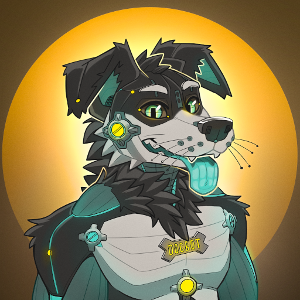

# DogBot 🐶

## Commands
### `/summarize`
Summarize group chat messages sent since the last summary (or as many as possible)

### `/summarize_nicely`
Like above but be very nice about it

### `/vibe_check`
Analyze chat members' moods

### `/stats`
Print statistics about the chat (only knows about stuff that's happened since bot was added to room)

## Features & Ideas
- [x] LLM chatroom summarization
  - [x] Aware of reply threads
  - [x] Aware of media presence (photo/video/etc) & captions on media
  - [x] "Vibe check" summary of users' moods
  - [ ] Feed previous summaries back into LLM prompt for longer "memory"
    * (`/summarize_past_summaries` command?)
- [x] Rake task which auto-deletes old messages
- [ ] Automatically transcribe all voice messages sent in the chat & translate to English
- [ ] Jannie features
  - [ ] Granular authorization: only admins/mods can execute commands, etc.
  - [ ] Customizable old-message-deletion timeframe
- [ ] Summarize links somehow?
  - [ ] Maybe if `/summarize` command is followed by a URL
  - [ ] or `/summarize` command is a reply to another msg containing a URL

## Deployment
Designed to be deployed on Heroku, but should be adaptable to any service.

### Heroku Scheduler
A rake task `rake purge_old_telegram_messages` is set up to purge old messages from the DB. This is intended to be run on a daily basis by a [Heroku Scheduler](https://devcenter.heroku.com/articles/scheduler) task.

## Local Development
### Install
1. Install postgres, ruby, bundler, heroku CLI.
2. `bundle install`
3. Setup database or whatever.
4. Configure options in rails credentials (see [credentials.sample.yml](./config/credentials.sample.yml)).

### Run local dev environment
* `just run`

  or

* `heroku local --procfile=Procfile.dev`

### Run linter & tests
* `just test`

  (runs `rubocop` and `rspec` in parallel)
